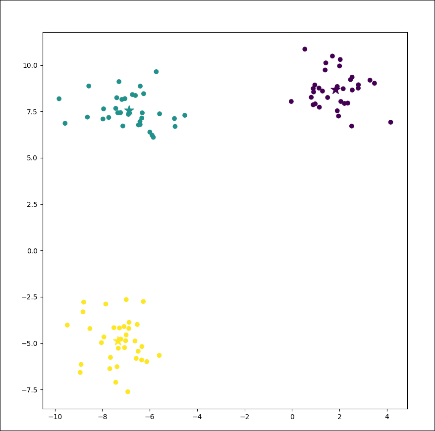

# 📊 Clustify - K-Means Clustering from Scratch

This project implements the **K-Means Clustering algorithm** using NumPy — a fundamental unsupervised learning technique for grouping data into `k` distinct clusters based on similarity.
---

### Final Clusters



---

## 🚀 Features

- Custom K-Means clustering without using scikit-learn's built-in clustering tools.
- Uses NumPy for numerical operations and distance calculations.
- Visualizes clustering results using Matplotlib.
- Clean and modular class-based implementation.
- Adjustable number of clusters (`k`) and iterations.

---

## 🧠 What is K-Means?

K-Means is a popular unsupervised machine learning algorithm used for clustering data into **k groups**. It works by:

1. Randomly initializing `k` centroids.
2. Assigning each data point to the nearest centroid (based on Euclidean distance).
3. Recomputing centroids as the mean of all assigned points.
4. Repeating steps 2–3 until convergence or reaching max iterations.

---

## 🧰 Technologies Used

- **Python 3**
- **NumPy** for mathematical computations
- **Matplotlib** for visualization
- **scikit-learn** (only for generating synthetic datasets using `make_blobs`)

---

## 📦 How to Run

1. **Clone the repository:**
   ```bash
   git clone https://github.com/Raksha-Karn/Clustify.git
   ```
2. **Install Dependencies:**
   ```bash
   pip install -r requirements.txt
   ```
3. **Run the Code:**
   ```bash
   python visualization.py
   ```
